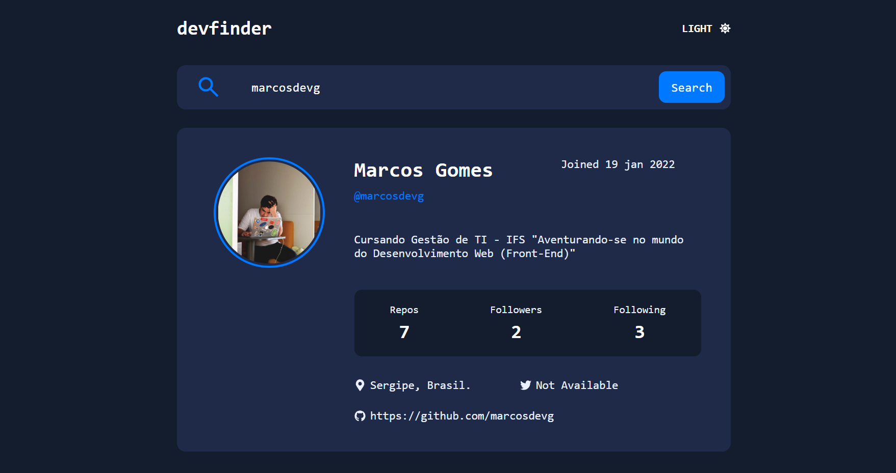

<h1 align="center"> Devfinder</h1>

  <a href="#-tecnologias">Tecnologias</a>&nbsp;&nbsp;&nbsp;|&nbsp;&nbsp;&nbsp;
  <a href="#-projeto">Projeto</a>&nbsp;&nbsp;&nbsp;|&nbsp;&nbsp;&nbsp;
  <a href="#memo-licença">Licença</a>

  

 

<h1>Desktop:</h1>
  
  
  
 
<h1>Mobile:</h1>
  
  

## 🚀 Tecnologias

Esse projeto foi desenvolvido com as seguintes tecnologias:

- React
- CSS Modules
- Vite
- API do Github

## 💻 Projeto
O projeto Devfinder é uma aplicação web que fornece informações detalhadas sobre um usuário do Github com base no nome de usuário fornecido. Ele retorna dados como nome, data de entrada no Github, bio, número de repositórios, número de seguidores, número de pessoas que ele segue e localização do usuário. A aplicação possui modos dark e light e é responsiva. É uma ferramenta útil para desenvolvedores e usuários do Github

## 📝 Licença

Esse projeto está sob a licença MIT.

---
